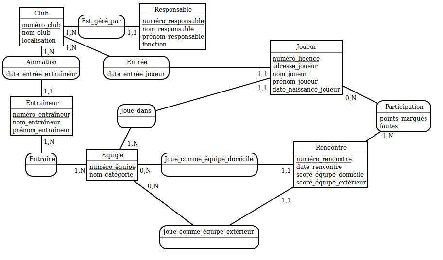
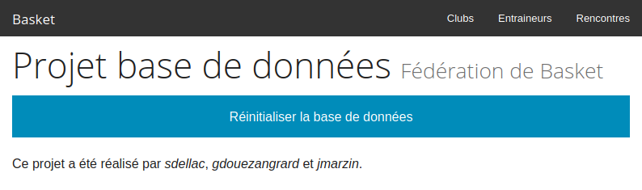
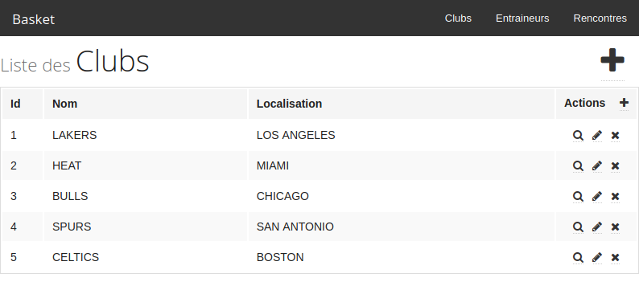
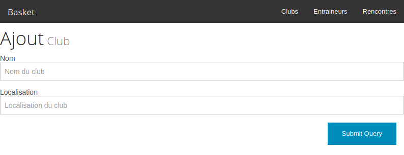
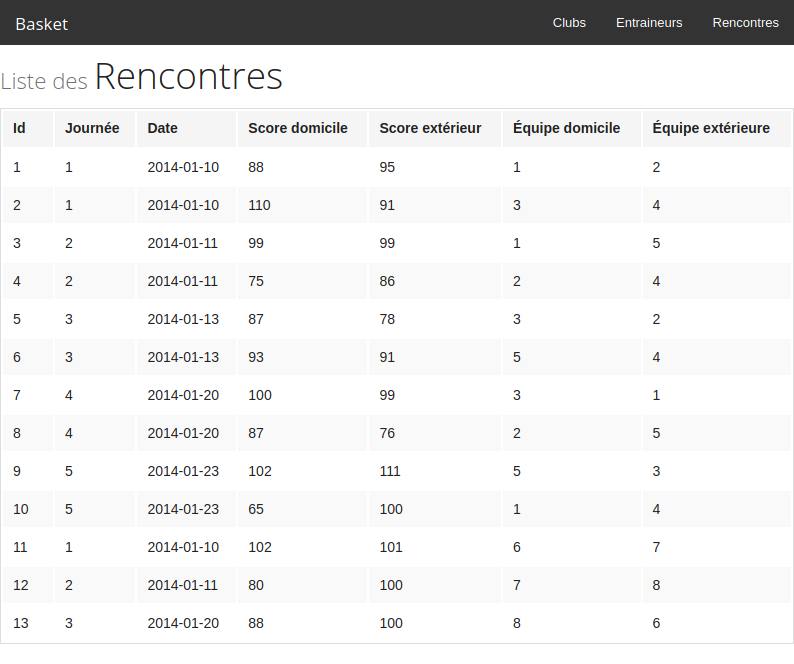

# Database Management System project with PHP / MySQL

[Report](doc/report/main.pdf) | [Slides](doc/slides.pdf)

## Usage

1. Set the database credentials in `src/config.php`.
2. Uncomment `extension=pdo_mysql` in `/etc/php/php.ini`.
3. Run `php -S localhost:8080` from `src/web`.

## Screenshots

